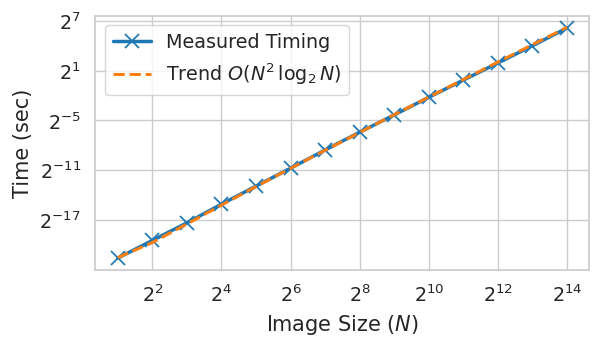

# Summary

The Radon transform is a fundamental integral transform that arises in many
different fields including medical/seismic tomography, signal/image processing,
and the analysis of partial differential equations [@Natterer2001]. The forward
transform computes integrals over lines of an input image at various angles and
offsets.  This package implements a discretization of this transform called the
approximate discrete Radon transform (ADRT) which computes integrals over pixel
line segments allowing for a faster evaluation over digital images [@Brady1998;
@Gotz96fdrt]. We provide an implementation of the ADRT and related transforms
including a back-projection operation, a single-quadrant inverse, and the full
multigrid inverse described in @Press2006. Each of these routines is accessible
from Python, operates on NumPy arrays [@harris2020array], and is implemented in
C++ with optional OpenMP multithreading.

# Statement of need

This package, `adrt`, aims to facilitate numerical experimentation with the ADRT
by providing production-ready implementations of the ADRT algorithm and related
transforms. We expect it to be useful in several broad respects: in scientific
computing applications, in studying the properties of the ADRT, and in preparing
new specialized software implementations.

The ADRT has demonstrated usefulness in scientific computing [@Rim2018] and has
applications in imaging, image processing, and machine learning which can
benefit from the increased performance of the ADRT, which has a time complexity
of $\mathcal{O}(N^2 \log N)$ for an $N \times N$ image (see \autoref{fig:timing}), compared to
$\mathcal{O}(N^3)$ for the standard Radon transform [@Press2006]. The ADRT
approximates the Radon transform with $\mathcal{O}(N^{-1} \log N)$ error, and it
possesses important inversion properties which enable it to be used to
approximate the inverse Radon transform [@Press2006; @Rim2020]. Our
documentation includes examples of the application of these routines to sample
problems in tomography and PDEs, as well as recipes for implementing other
transforms with our core routines, including an iterative inverse using
the conjugate gradient iteration.

{ width=60% }

These routines also support research into the ADRT itself. While some private
implementations exist [@radonopencl], to the best of our knowledge this is the
only publicly available, open source implementation packaged for general use.
This implementation provides a testbed for studying the ADRT, including routines
exposing the progress of internal iterations. This package can also assist the
development of specialized implementations, either by serving as a reference for
new development or through reuse of the core C++ source which is independent of
Python.

# Related research and software

A variety of other discretizations and approximations of the Radon transform
exist, such as a linear interpolation and filtered back-projection in
@scikit-image; the discrete Radon transform [@Beylkin1987]; a fast transform
based on the pseudo-polar Fourier transform [@ACDISS2008]; and the non-uniform
fast Fourier transform (NUFFT) [@GreengardLee2004; @BMK2019]. However, the ADRT
has unique properties that distinguish it from other discretizations, such as
its localization property and range characterization [@LRR2023].

# Acknowledgments

This work was partially supported by the Department of Defense through the
National Defense Science & Engineering Graduate (NDSEG) Fellowship program, by
the Air Force Center of Excellence on Multi-Fidelity Modeling of Rocket
Combustor Dynamics under Award Number FA9550-17-1-0195, and by AFOSR MURI on
multi-information sources of multi-physics systems under Award Number
FA9550-15-1-0038.

# References
